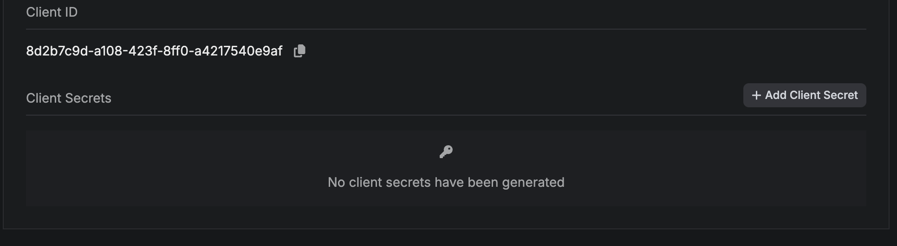

# Infisical


[Infisical](https://infisical.com/) is the software we use for managing secrets within the cluster. It follows the **external secrets operator** principle
outlined in [architecture](./architecture.md).

# Setup

To get infisical up and running, we need to configure an [authentication method](http://infisical.com/docs/integrations/platforms/kubernetes/infisical-secret-crd#authentication-methods).
The one with less friction would be the **universalAuth** where you simply create a secret that contains the clientId and the clientSecret. A more robust approach
can also be implemented using [Kubernetes Authentication](https://infisical.com/docs/integrations/platforms/kubernetes/infisical-secret-crd#authentication-kubernetesauth).

First, we head over to **project access control** in our infisical dashboard, and create a new machine identity.


We get a **client id** and then you can create a **client secret** by clicking on `add client secret` button.



Lastly, we run the following command to create the secret in the cluster for the insifical operator to authenticate.

```bash
kubectl create generic universal-auth-credentials --from-literal=clientId="<your-identity-client-id>" --from-literal=clientSecret="your-identity-client-secret>"
```

The operator will pick up the secret, and we will be able to export our secrets with the custom CRDs. For example, to fetch an infisical secret
we can use the **InfisicalSecret** CRD as follows.

```yaml
apiVersion: secrets.infisical.com/v1alpha1
kind: InfisicalSecret
metadata:
  name: my-infisical-secret
spec:
  authentication:
    universalAuth:
      secretsScope:
        projectSlug: <the-project-slug>

        envSlug: "" # "dev", "staging", "prod"
        secretsPath: "" # target a specific secrets path
      credentialsRef:
        secretName: universal-auth-credentials
        secretNamespace: "" # the namespace where the auth secret resides

  managedKubeSecretReferences:
    - secretName: my-secret # the name that the managed secret should have
      secretNamespace: "" # the namespace where the managed secret should reside
```

Additionally you can customize the structure of the secret by using template:

```yaml
managedKubeSecretReferences:
  - secretName: my-secret # the name that the managed secret should have
    secretNamespace: "" # the namespace where the managed secret should reside
    template:
    includeAllSecrets: true
    data:
    NEW_KEY_NAME: "{{ .KEY.SecretPath }} {{ .KEY.Value }}"
    KEY_WITH_BINARY_VALUE: "{{ .KEY.SecretPath }} {{ .KEY.Value }}"
```
